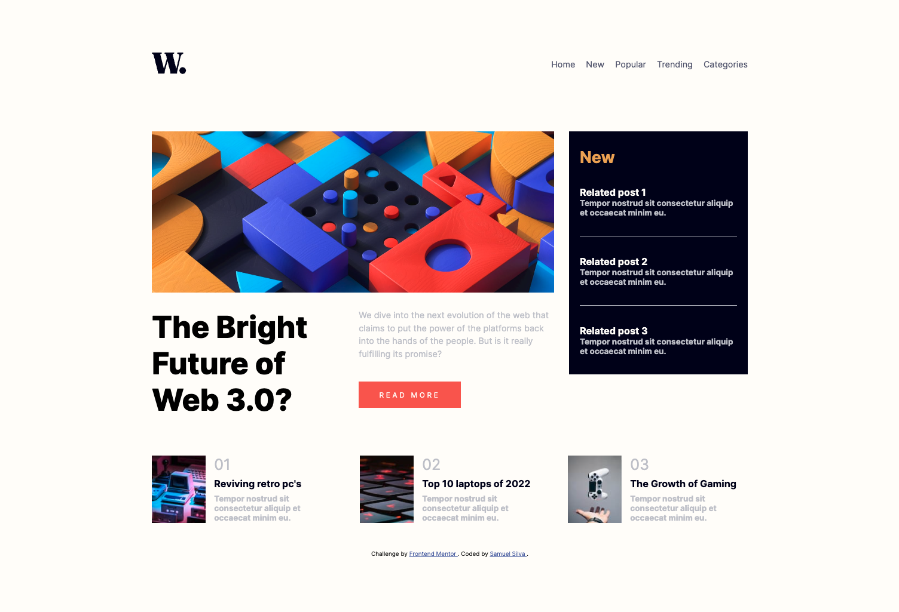

# Frontend Mentor - News homepage solution

This is a solution to the [News homepage challenge on Frontend Mentor](https://www.frontendmentor.io/challenges/news-homepage-H6SWTa1MFl). Frontend Mentor challenges help you improve your coding skills by building realistic projects.

> This is a second version of the challenge, built using astro. You can find the first version [here](https://github.com/samuelsilvadev/frontendmentor/tree/main/packages/news-homepage).

## Table of contents

- [Overview](#overview)
  - [The challenge](#the-challenge)
  - [Screenshot](#screenshot)
  - [Links](#links)
- [My process](#my-process)
  - [Built with](#built-with)
  - [Running locally](#running-locally)
  - [What I learned](#what-i-learned)

## Overview

### The challenge

Users should be able to:

- View the optimal layout for the interface depending on their device's screen size ✅
- See hover and focus states for all interactive elements on the page ✅
- **Bonus**: Toggle the mobile menu (requires some JavaScript) ✅

### Screenshot



### Links

- Live Site URL: [news-homepage-with-astro](https://frontendmentor-samuelsilvadev.vercel.app/news-homepage-with-astro)

## My process

### Built with

- [Astro](https://astro.build/) - SSG framework

### Running locally

First create a `.env` file and fill it with the variables described on the `.env.example` file.

```bash
  cp .env.example .env
```

Then, run the development server:

```bash
yarn dev
```

Open [http://localhost:3000](http://localhost:3000) with your browser to see the result.

### What I learned

- Create components on Astro
- Usage of @astro/image
